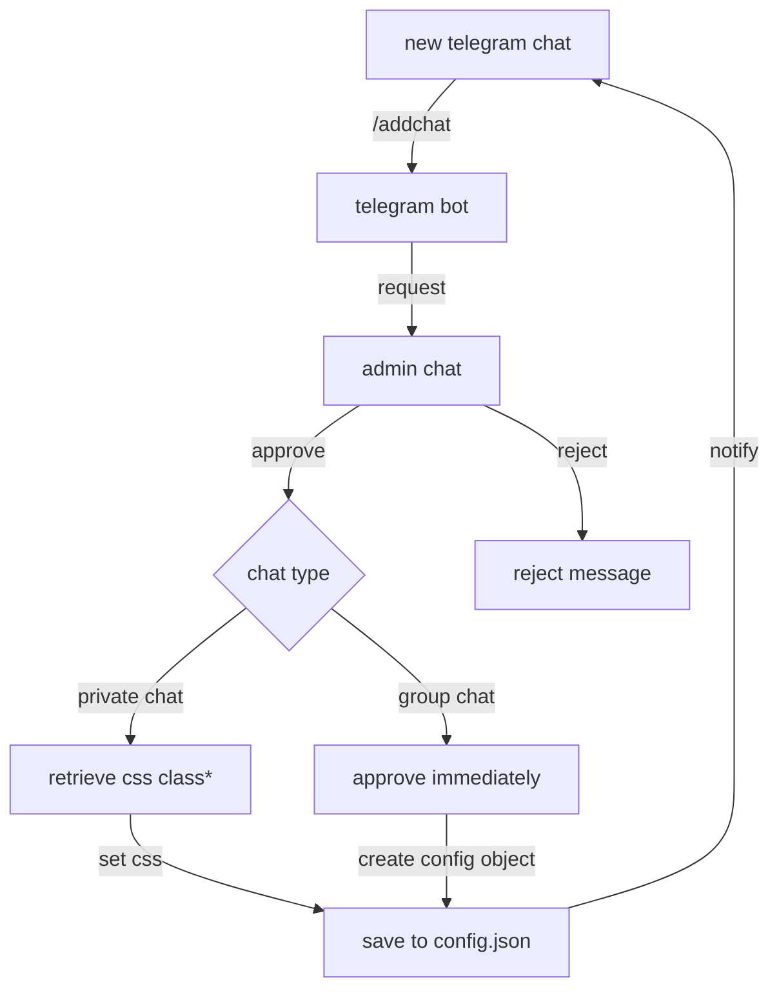
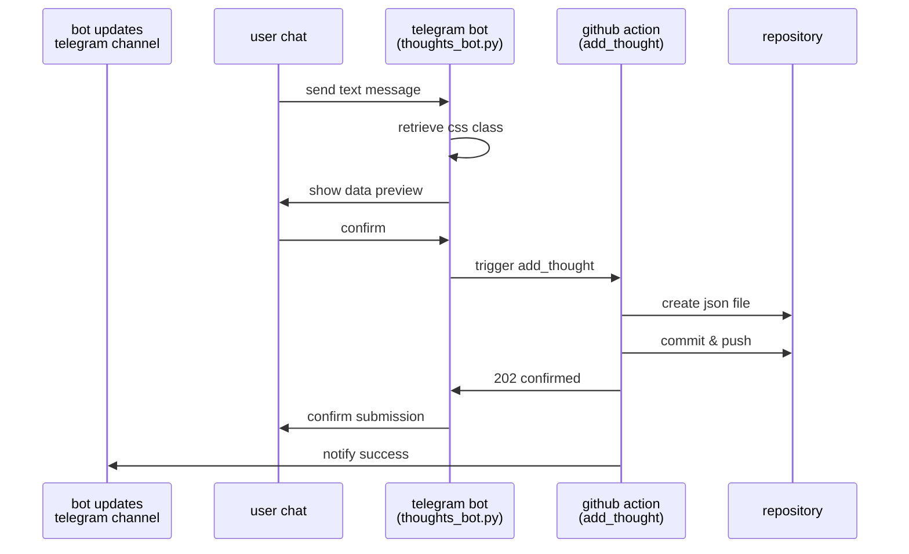
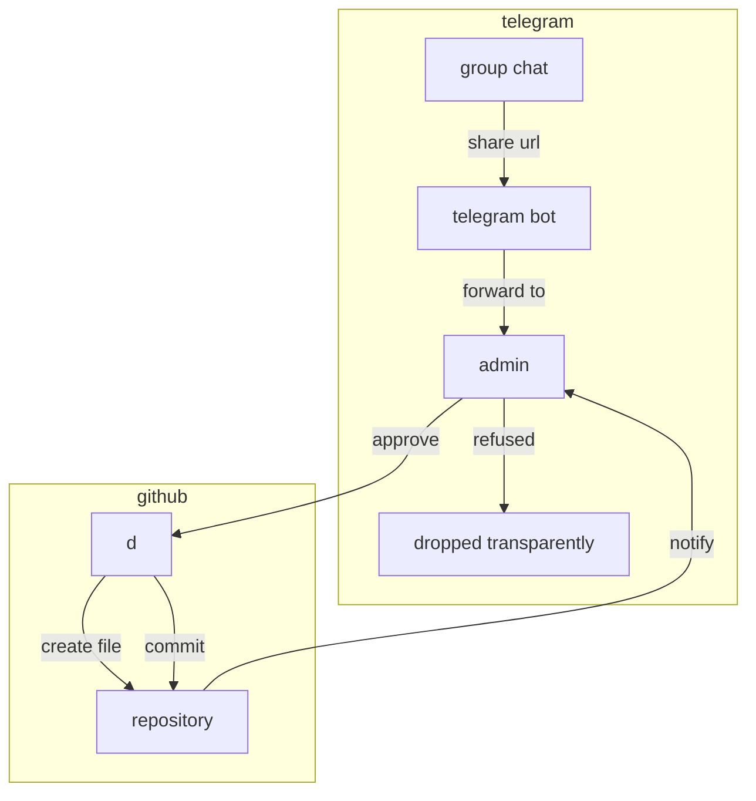

# telegram bot

This bot serves as a content manager for my family website, and it allows me to add content through Telegram. Two types of content so far:
- Personal thoughts (think tweets)
- Interesting links (think bookmarks)

## Types of content

### Thoughts
- Short text entries created in private chats with the bot
- Each thought has an author and a CSS class for styling according to that author (since each family member has its own color setting)
- Stored as JSON files in `src/bot_gen/thoughts/YYYY-MM/`
- Requires chat authorization but no per-message approval

### Selected Press
- URLs shared in authorized group chats
- Requires admin approval for each link
- Stored as JSON files in `src/bot_gen/selected_press/YYYY-MM/`
- Filter out certain platforms (low quality and excessively personal content)

## Data flows

### Chat authorization



\* i have 6 users, so i'll tell the bot myself what class to use, but with more users a small correspondance dataset is needed. Of course, that file should be kept private.

### Thoughts (content with no authorization needed)



### Selected press (authorization flow)


> [!NOTE]
> simplified compared to Thoughts sequence diagram, the github action works the same way

## What you need to run this yourself

1. Telegram Bot Token
   - Create a bot through @BotFather
   - Get the bot token
   - Remove privacy mode from bot (otherwise it won't read all messages)

2. GitHub Repository
   - Create a repository for your website
   - Create a Personal Access Token with repo permissions
   - Set up repository secrets:
     - `TELEGRAM_TOKEN`
     - `TELEGRAM_BOT_CHANNEL`

3. Configuration Files
   ```python
   # credentials.json
   {
       "bot_token": "YOUR_BOT_TOKEN",
       "admin_chat_id": "YOUR_TELEGRAM_ID",
       "github_repo": "username/repo",
       "github_token": "YOUR_GITHUB_TOKEN"
   }
   # config.json - Stores chat configurations, autogenerated
   {
       "chat_id": {
           "name": "Chat Name",
           "type": "private|group",
           "css_class": "style-class",  # Only for private chats
           "default_author": "Author Name"  # Only for private chats
       }
   }
   ```

4. Python Dependencies
   ```bash
   pip install -r requirements.txt
   ```
5. `python thoughts_bot.py`

## changes i'll probably make
1. move to `uv` for "single scrip t package"
2. remove `datetime` from sent data, use github (this would make even misplacing the token fairly safe)


## Changes i might eventually make
1. Press Enhancement
   - Fetch and show page title for links
   - Add brief description
   - tags
2. Content Management
   - Edit/delete capabilities for existing content
   - Categories or tags for better organization
   - Draft system for longer content

## changes i wish i'd make and never will

1. Use PR flow:
    - Commit to PR
    - Check results with other workflows, then merge

1. Authentication
   - Multiple admin support
   - Group-specific content streams

1. UI/UX Improvements
   - Real preview
   - Bot reaction to messages with shared URLs

1. Integration
   - same bot on other platforms
   - Better error handling and recovery(when network is down... you send a message to the admin? :grin:)